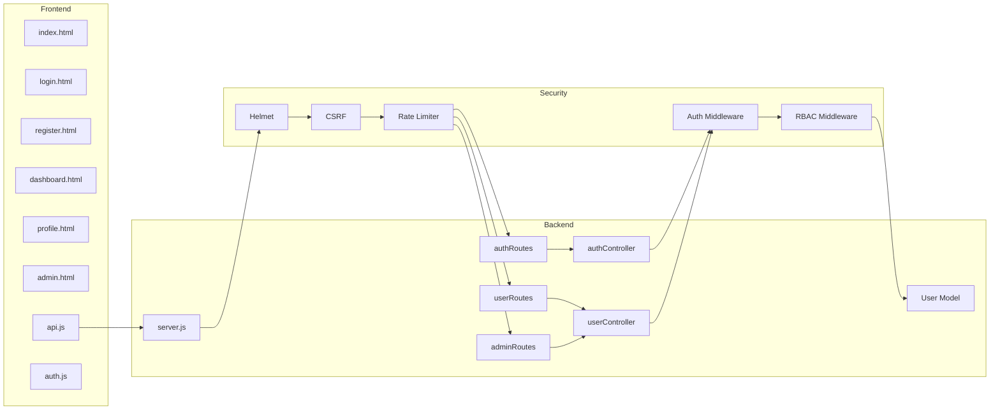
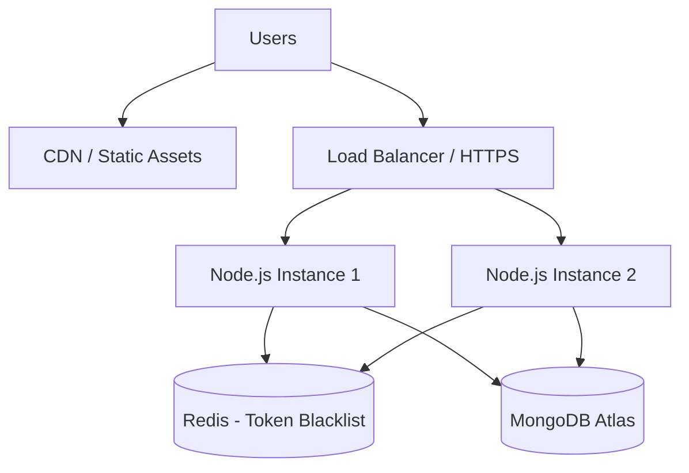

# Architecture Documentation

## Secure User Management Web Application

---

## 1. System Overview

The application follows a **three-tier architecture**:

```
┌─────────────────────────────────────────────────────────────┐
│                    PRESENTATION LAYER                        │
│         HTML5 + CSS3 + Bootstrap 5 + JavaScript              │
│    (Landing, Login, Register, Dashboard, Profile, Admin)     │
└─────────────────────────┬───────────────────────────────────┘
                          │ HTTP/HTTPS (REST API + Cookies)
┌─────────────────────────▼───────────────────────────────────┐
│                    APPLICATION LAYER                           │
│              Node.js + Express.js Server                     │
│  ┌─────────┐ ┌──────────┐ ┌──────────┐ ┌─────────────────┐  │
│  │ Routes  │ │Middleware│ │Controllers│ │ Security Layer  │  │
│  └─────────┘ └──────────┘ └──────────┘ └─────────────────┘  │
└─────────────────────────┬───────────────────────────────────┘
                          │ Mongoose ODM
┌─────────────────────────▼───────────────────────────────────┐
│                      DATA LAYER                              │
│                   MongoDB Atlas (Cloud)                      │
│                    User Collection                           │
└─────────────────────────────────────────────────────────────┘
```

---

## 2. Component Architecture



---

## 3. Layer Responsibilities

### 3.1 Presentation Layer (Frontend)

| Component | Responsibility |
|-----------|----------------|
| HTML Pages | UI structure, forms, navigation |
| CSS (style.css) | Custom styling, responsive design |
| api.js | HTTP client, CSRF token management |
| auth.js | Session state, route protection |
| admin.js | Admin panel CRUD operations |
| utils.js | XSS escaping, alerts, formatting |

### 3.2 Application Layer (Backend)

| Component | Responsibility |
|-----------|----------------|
| server.js | App bootstrap, middleware chain, static files |
| Routes | URL-to-controller mapping |
| Controllers | Business logic, request/response handling |
| Middleware | Cross-cutting concerns (auth, validation, errors) |
| Models | Data schema, validation, password hashing |

### 3.3 Data Layer

| Component | Responsibility |
|-----------|----------------|
| MongoDB Atlas | Persistent document storage |
| Mongoose | Schema validation, queries, indexing |
| User Model | User entity with role, auth fields |

---

## 4. Request Processing Pipeline

Every API request flows through this pipeline:

```
Incoming Request
    │
    ▼
┌──────────────┐
│   Helmet     │  Set security HTTP headers
└──────┬───────┘
       ▼
┌──────────────┐
│    CORS      │  Validate origin
└──────┬───────┘
       ▼
┌──────────────┐
│ Rate Limiter │  Throttle excessive requests
└──────┬───────┘
       ▼
┌──────────────┐
│ Body Parser  │  Parse JSON (max 10kb)
└──────┬───────┘
       ▼
┌──────────────┐
│ Cookie Parser│  Parse signed cookies
└──────┬───────┘
       ▼
┌──────────────┐
│Mongo Sanitize │  Strip NoSQL injection operators
└──────┬───────┘
       ▼
┌──────────────┐
│  XSS Clean   │  Sanitize input strings
└──────┬───────┘
       ▼
┌──────────────┐
│     HPP      │  Prevent HTTP parameter pollution
└──────┬───────┘
       ▼
┌──────────────┐
│     CSRF     │  Validate CSRF token (mutations)
└──────┬───────┘
       ▼
┌──────────────┐
│   Router     │  Match route → controller
└──────┬───────┘
       ▼
┌──────────────┐
│ Auth (JWT)   │  Verify token (protected routes)
└──────┬───────┘
       ▼
┌──────────────┐
│ Authorize    │  Check role (admin routes)
└──────┬───────┘
       ▼
┌──────────────┐
│  Validate    │  Input validation rules
└──────┬───────┘
       ▼
┌──────────────┐
│  Controller  │  Execute business logic
└──────┬───────┘
       ▼
┌──────────────┐
│Error Handler │  Format error response
└──────────────┘
```

---

## 5. Authentication Architecture

### Token Strategy: Dual-Token Pattern

```
┌─────────────────────────────────────────────────┐
│                  Access Token                    │
│  • Short-lived (1 hour)                          │
│  • Contains: userId, email, role                 │
│  • Stored in HTTP-only cookie                    │
│  • Used for API authorization                    │
└─────────────────────────────────────────────────┘

┌─────────────────────────────────────────────────┐
│                 Refresh Token                    │
│  • Long-lived (7 days)                           │
│  • Contains: userId, tokenVersion                │
│  • Stored in separate HTTP-only cookie           │
│  • Used only to obtain new access tokens         │
└─────────────────────────────────────────────────┘
```

### Why HTTP-only Cookies over localStorage?

| Aspect | localStorage | HTTP-only Cookie |
|--------|-------------|------------------|
| XSS Access | Vulnerable | Not accessible via JS |
| CSRF | Not sent automatically | Mitigated with CSRF tokens |
| Auto-send | Manual | Automatic with requests |

---

## 6. Deployment Architecture (Production)



### Production Recommendations

- Deploy behind HTTPS (TLS 1.2+)
- Use Redis for token blacklist (instead of in-memory)
- Set `NODE_ENV=production`
- Enable MongoDB Atlas IP whitelisting
- Use environment-specific secrets
- Enable MongoDB backup and monitoring

---

## 7. Scalability Considerations

| Concern | Current Implementation | Production Scale |
|---------|----------------------|------------------|
| Token blacklist | In-memory Map | Redis with TTL |
| Sessions | Stateless JWT | Stateless (no change needed) |
| Database | Single Atlas cluster | Replica sets, sharding |
| Rate limiting | In-memory per instance | Redis-backed rate limiter |
| File storage | N/A | N/A |

---

*This architecture balances security, simplicity, and internship demonstration requirements.*
