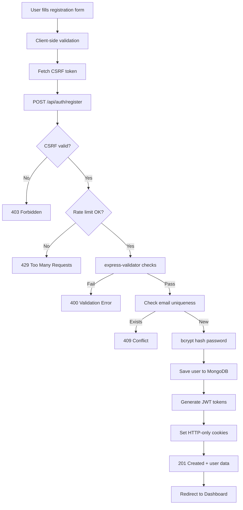
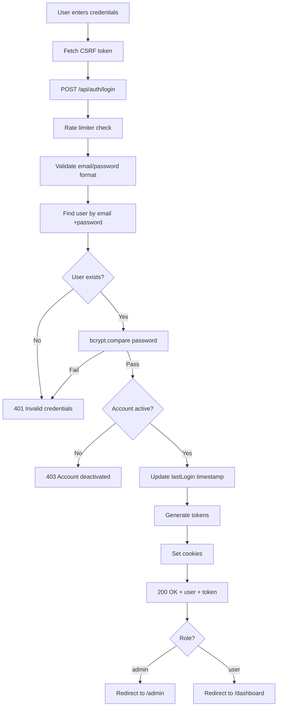
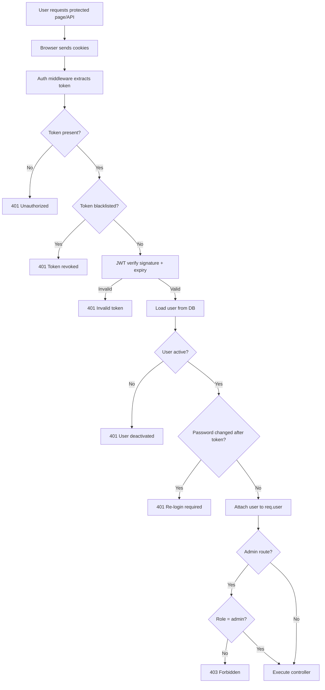
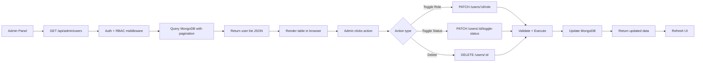
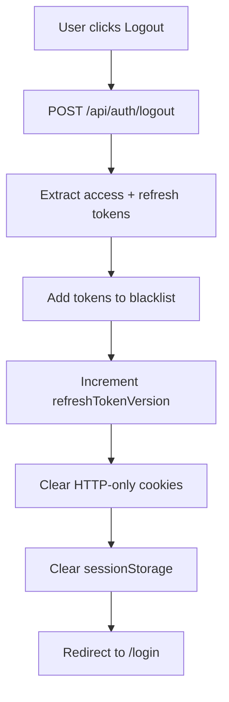

# Data Flow Documentation

## Secure User Management Web Application

---

## 1. User Registration Data Flow



### Data Transformations (Registration)

| Step | Input | Output |
|------|-------|--------|
| Validation | Raw form data | Sanitized strings |
| Password hash | Plain text password | bcrypt hash (60 chars) |
| JWT creation | User ID, email, role | Signed access + refresh tokens |
| DB storage | User object | MongoDB document with `_id` |

---

## 2. User Login Data Flow



---

## 3. Protected Route Access Flow



---

## 4. Admin User Management Data Flow



---

## 5. Logout Data Flow



---

## 6. Data Model Flow

```
┌──────────────────────────────────────────────┐
│              User Document                    │
├──────────────────────────────────────────────┤
│ _id: ObjectId                                │
│ name: String (2-50 chars)                    │
│ email: String (unique, lowercase)            │
│ password: String (bcrypt hash, select:false)  │
│ role: "user" | "admin"                       │
│ isActive: Boolean                            │
│ lastLogin: Date                              │
│ passwordChangedAt: Date                      │
│ refreshTokenVersion: Number                  │
│ createdAt: Date (auto)                       │
│ updatedAt: Date (auto)                       │
└──────────────────────────────────────────────┘
```

### Indexes

- `{ email: 1 }` — Fast login lookups
- `{ role: 1 }` — Admin dashboard queries

---

## 7. Error Data Flow

```
Error occurs in controller
        │
        ▼
   next(error) called
        │
        ▼
┌───────────────────┐
│  Error Handler    │
│                   │
│ Mongoose Validation → 400
│ Duplicate key (11000) → 409
│ CastError → 400
│ AppError → custom status
│ Unknown → 500 (generic message)
└───────────────────┘
        │
        ▼
{ success: false, message: "..." }
(No stack trace in production)
```

---

*Data flows are designed to minimize sensitive data exposure at every step.*
