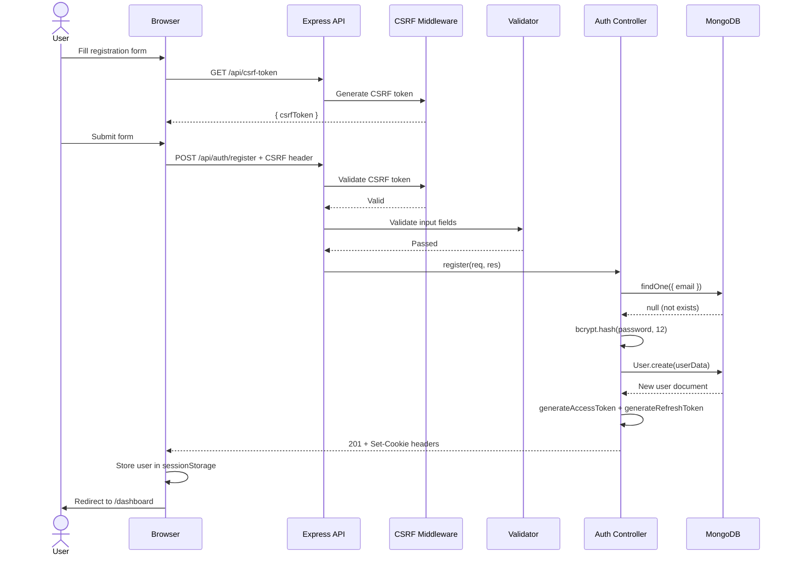
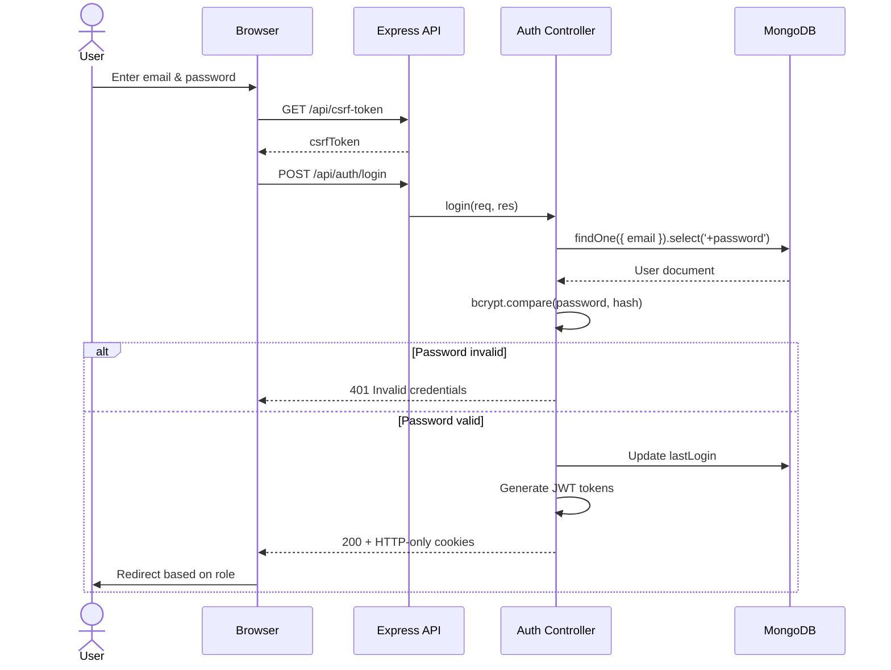
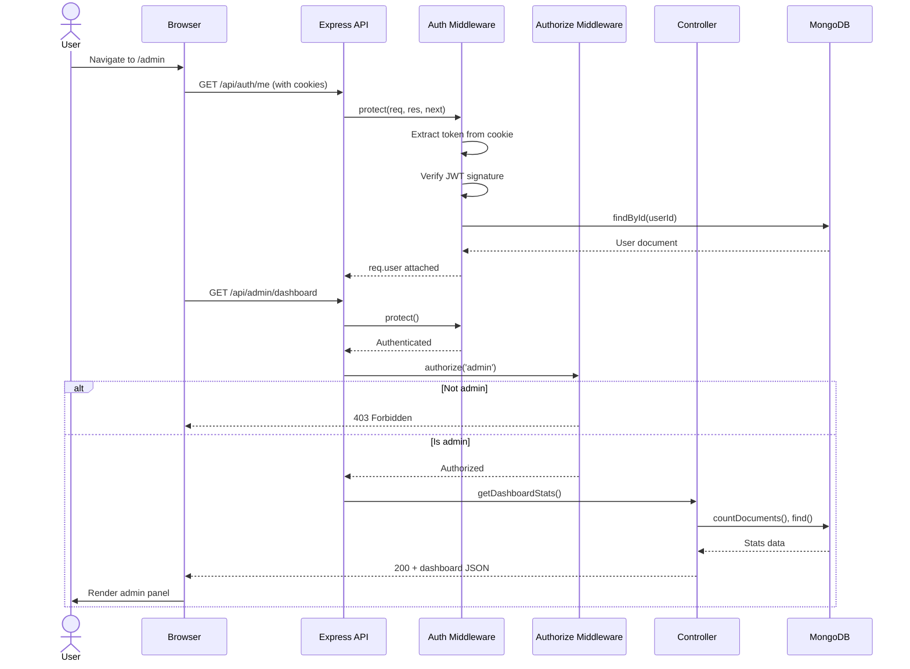
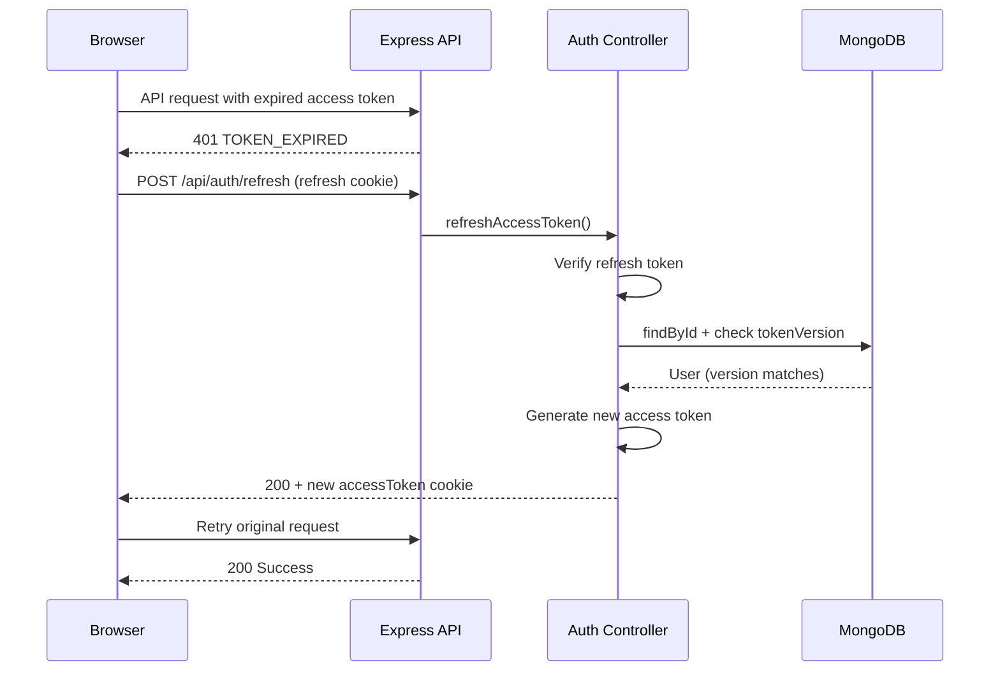
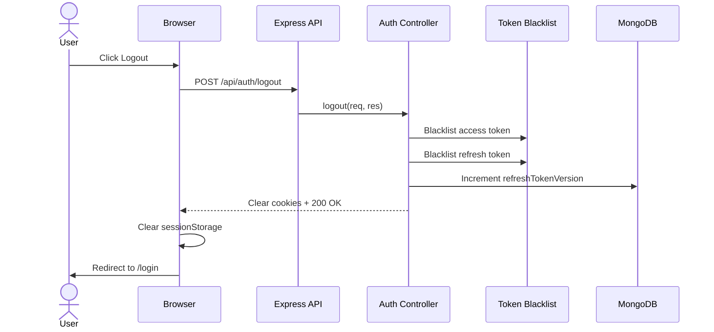
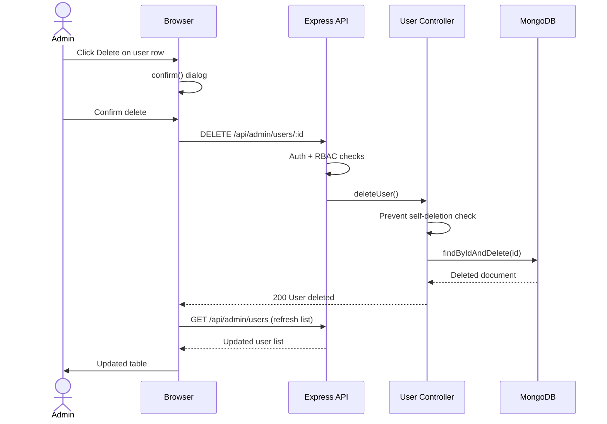
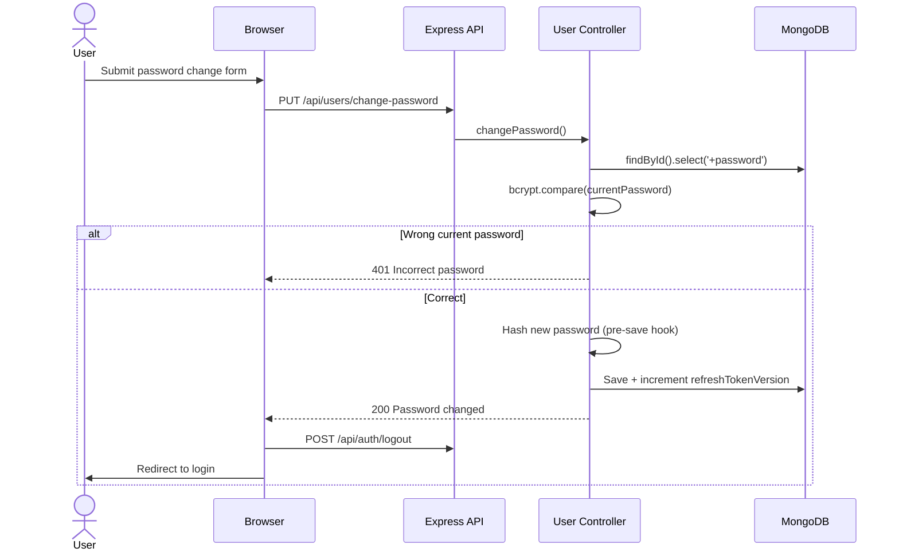

# Sequence Diagrams

## Secure User Management Web Application

---

## 1. User Registration Sequence

---

## 2. User Login Sequence

---

## 3. Access Protected Resource Sequence

---

## 4. Token Refresh Sequence

---

## 5. Logout Sequence

---

## 6. Admin Delete User Sequence

---

## 7. Change Password Sequence

---

*These sequence diagrams illustrate the complete request lifecycle for all major application flows.*
